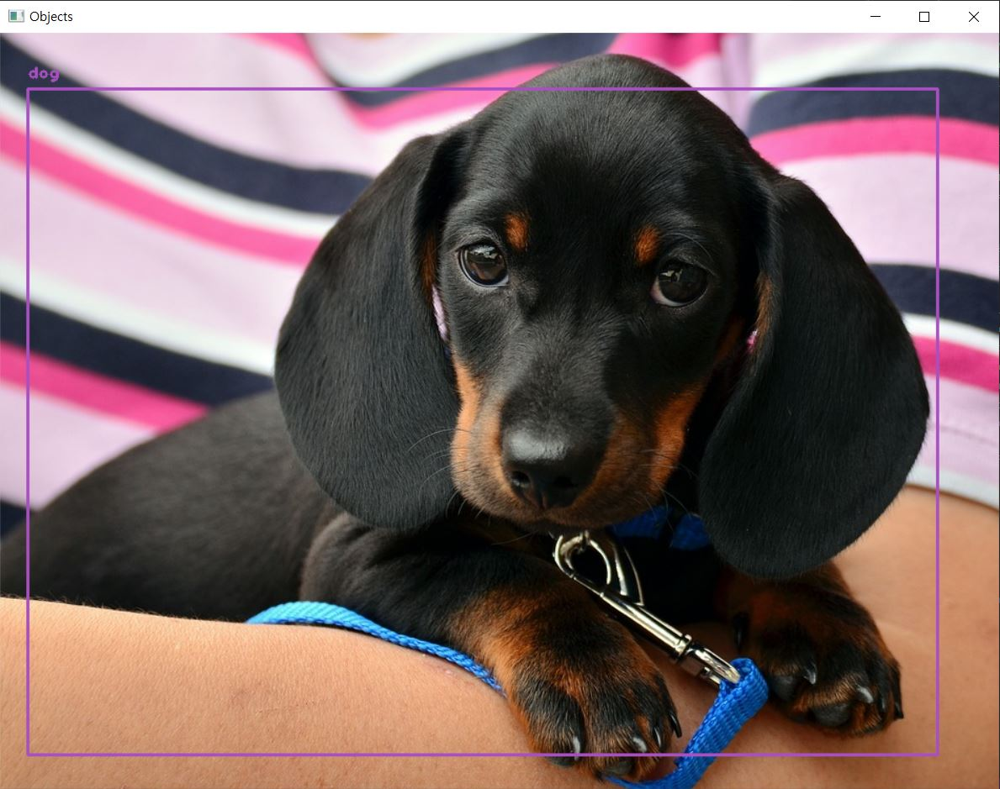
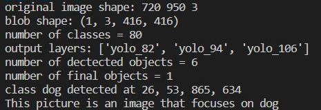

# What is this program
- A program that recognizes an object in a picture, determines which object is the focus of the picture based on the recognized object, and outputs a landscape such as a driveway or bookstore or flock
- if cannot recognize what this landscape is, print the determined things in the picture by program 
- ----------
# Demo Photo
- output of image

- output of determined data of an image

---------
# packages and version, source code that used
- YOLO code from professor YOUNGMIN OH, Gachon University and <https://opencv-tutorial.readthedocs.io/en/latest/yolo/yolo.html>
- ‘coco.names’ from  <https://github.com/pjreddie/darknet/blob/master/data/coco.names>
- ‘yolov3.cfg’ from  <https://github.com/pjreddie/darknet/blob/master/cfg/yolov3.cfg>
- ‘yolo3.weights’ from  <https://pjreddie.com/media/files/yolov3.weights>

------------------------------
# How to run this program

0. Download 'part1_fin.py', 'part2_3_fin_fin.py', 'coco.names', 'yolov3.cfg', ‘yolo3.weights’ in this repository

1. Make sure put 'part1_fin.py', 'part2_3_fin_fin.py' to same path.
2. Make sure ‘coco.names’ file path to C://for_anaconda/coco.names
3. ‘yolov3.cfg’ file path to C://for_anaconda/yolov3.cfg
4. ‘yolo3.weights’ file path to C://for_anaconda/yolov3.weights
5. Make sure that name image you want to use to ‘image.jpg’
6. And put the image path to C://for_anaconda/image.jpg
7. And run 'part2_3_fin.py' file

